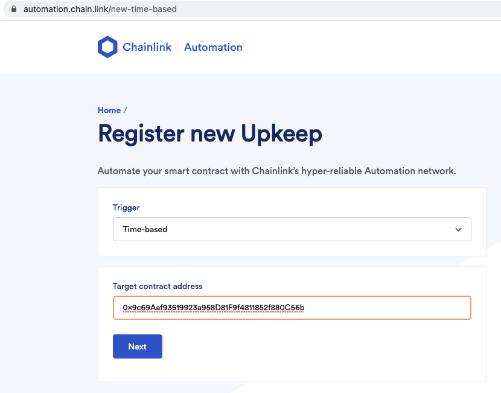
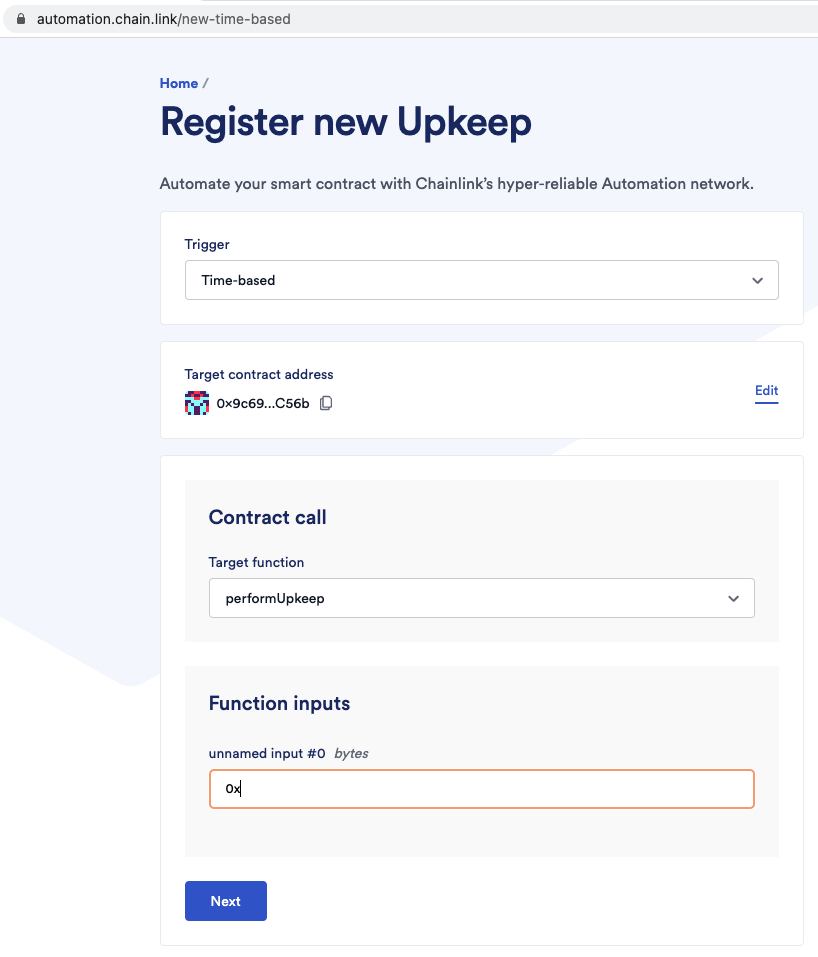
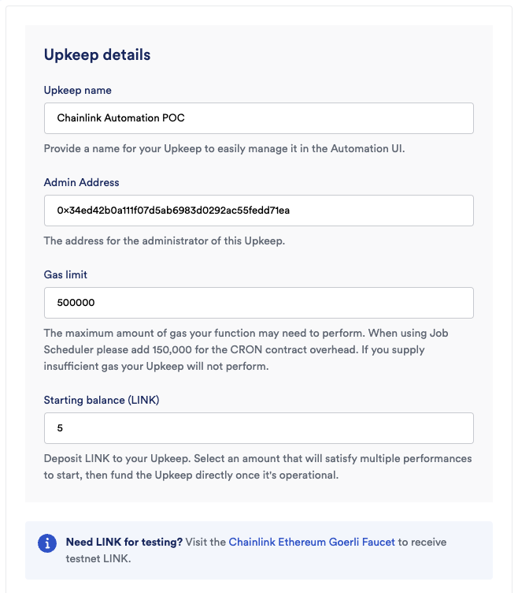
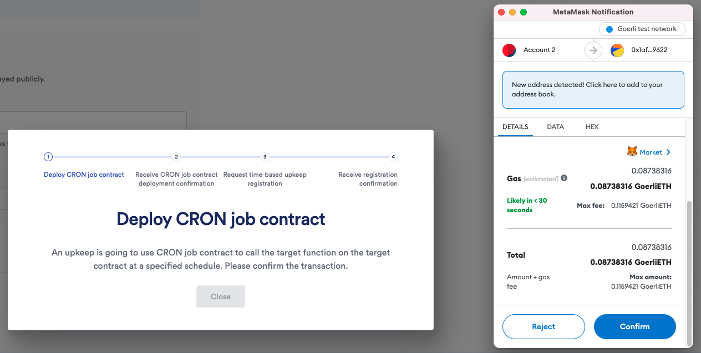
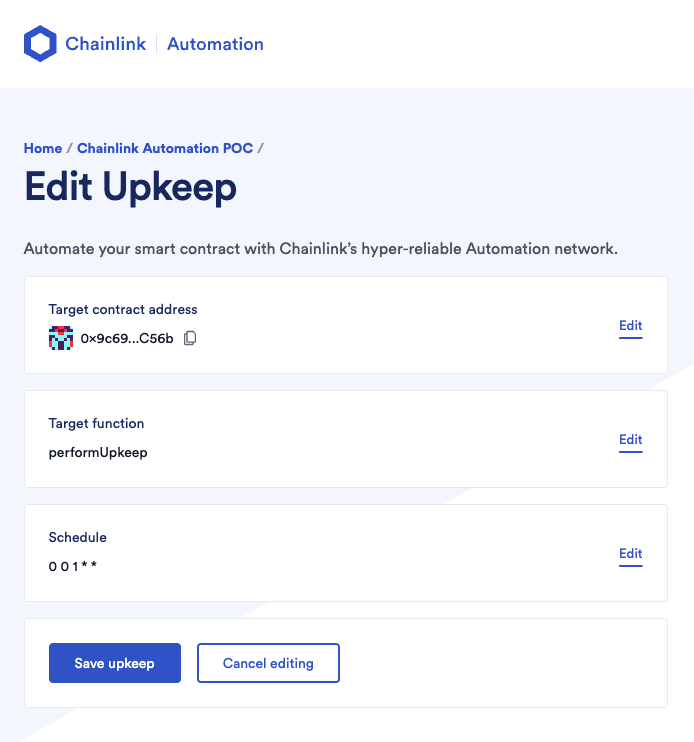

# Chainlink Automation Integration

Since it's mainly UI based on https://automation.chain.link, the integration process is quite straight forward. Upkeep for example contract in this repo is: [Chainlink Automation POC](https://automation.chain.link/goerli/40823493879287237498829783646478093585123121655655608779267186926527689458155)

Funds are paid up-front when we create the upkeep, and can be easily added on UI, so we don't need to write a script to automate the payment step each time.

## Key Steps

1. Deploy your target contract
2. Register a time-based upkeep and set it up with target contract address (no code required)

## UpKeep Registration

1. Set target contract address
   

2. Chainlink will automatically show the functions we can call. `performUpkeep` is the function in example contract controlling counter incrementation. It receives no param, so just set it to `0x`
   

3. Set the trigger interval in CRON expression
   

4. Set Upkeep details, initial funds (Staring balance) is set here
   

5. Confirm registration
   

6. We can add funds, edit upkeep details like: target contract address, trigger interval, etc. after registration
   
